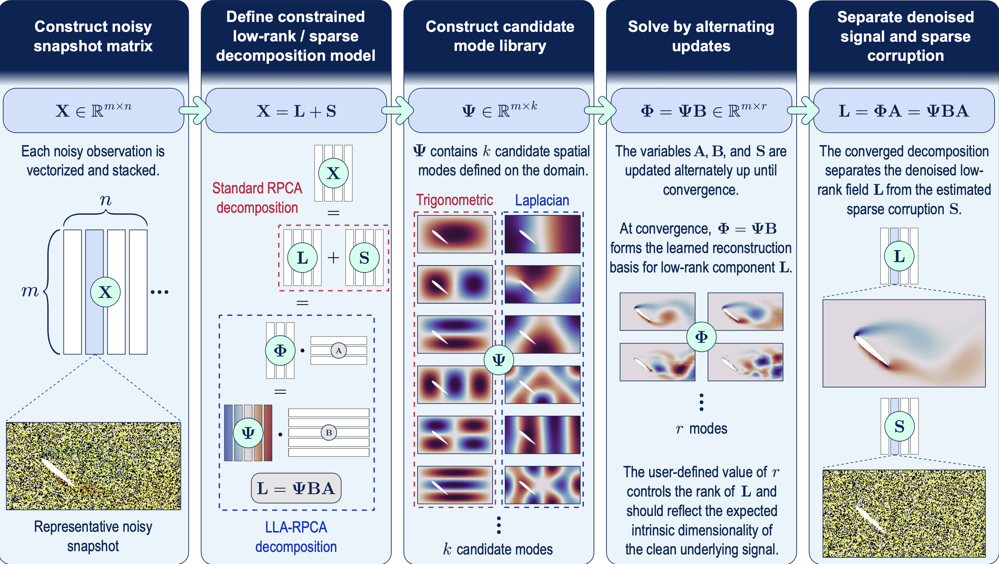

# Library-RPCA

An example code of library-learning-assisted RPCA for denoising of fluid flows by Koop, Scherl, and Fukami.

  

Figure: Overview of the Library-RPCA workflow — constructing noisy snapshots, defining a constrained low-rank + sparse decomposition, building a candidate mode library, learning a reconstruction basis, and separating denoised signal from sparse corruption.

An example dataset of flow around a NACA0012 airfoil is also available.

# Authors
Author: Pablo Koop and [Kai Fukami](https://www.kaif.mech.tohoku.ac.jp/) (Tohoku University)

# Directory structure
        main/
        ├── data/
        │   ├── naca0012_demo_data.mat
        │   └── naca0012_demo_geometry.inp
        ├── functions/
        │   ├── lla_rpca_demo_solver.m
        │   └── rpca_solver.m
        └── scripts/
            └── lla_rpca_demo_main.m

Authors provide no guarantees for this code. Use as-is and for academic research use only; no commercial use allowed without permission. The code is written for educational clarity and not for speed.

# Reference
Pablo Koop, Isabel Scherl, and Kai Fukami, “Library-learning-assisted robust principal component analysis for denoising severely corrupted flow fields," in Review.
